# OWASP Top 10 – Hands-On Vulnerability Awareness
### Day 1 Assignment | Security Testing Learning Series
**Author:** Sparsh Bhardwaj  
**Repository:** `owasp_security_testing-training-sparsh`  
**Subfolder:** `day1-owasp-workshop`  
**Target Application:** OWASP Juice Shop (local instance)  
**Tools Used:** Burp Suite, Browser DevTools, Browser Console (JavaScript), Postman, OWASP Juice Shop

---

##  Repository Structure

```
owasp_security_testing-training-sparsh/
├── README.md
└── day1-owasp-workshop/
    ├── screenshots/
```

---

##  Task Execution & Findings

---

### Task 1 — Broken Access Control & Injection

#### 1a. Post a Review as Another User (Broken Access Control)

**Method:** Intercepted `PUT /rest/products/{id}/reviews` in Burp Suite and modified the `author` field in the request body.

**Finding:** The API does not validate whether the authenticated session matches the `author` value in the payload. Any logged-in user can impersonate any other user when submitting or editing reviews.

**Root Cause:** Missing server-side ownership validation. The backend trusts the client-supplied `author` field rather than deriving it from the authenticated session token.

**OWASP Category:** A01 – Broken Access Control

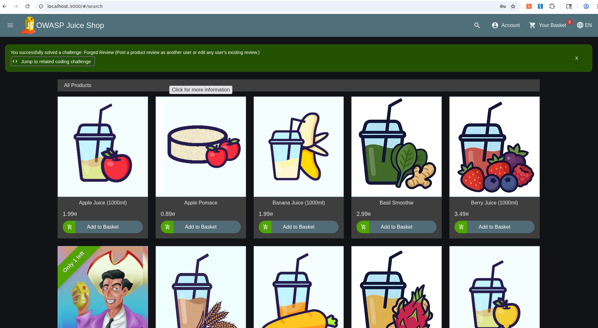
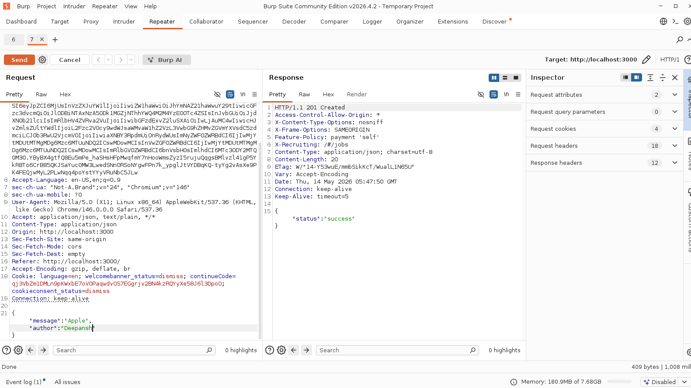

---

#### 1b. Access Administration Panel & Delete 5-Star Reviews (SQL Injection + URL Manipulation)

**Method (Step 1 — SQL Injection Login):** On the Juice Shop login page, entered `' OR 1=1--` in the email field with any password. This bypassed authentication entirely and logged in as `admin@juice-sh.op`, the first user in the database.

**Method (Step 2 — URL Manipulation):** Navigated directly to `http://localhost:3000/#/administration`. The admin panel loaded without any role verification, and all 5-star reviews were deleted from the panel.

**Finding:** Two separate vulnerabilities chained together:
1. The login form passes user input directly into a SQL query without parameterisation, allowing `OR 1=1` to always evaluate true and return the first database row (admin).
2. Even without the SQL injection, the administration panel is accessible to any user via direct URL, access control exists only at the Angular route guard level, not at the API or server level.

**Root Cause:** 
- SQL Injection: user-supplied input is not sanitised or parameterised before being used in a database query.
- Broken Access Control: the backend serves the admin panel to any authenticated session regardless of role, trusting the frontend to enforce access restrictions.

**OWASP Categories:** A03 – Injection, A01 – Broken Access Control

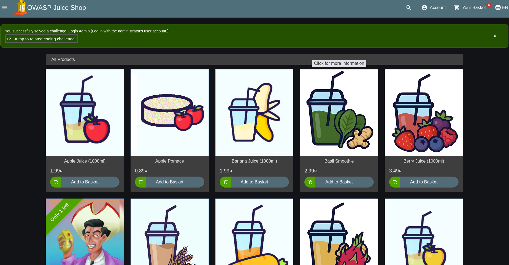
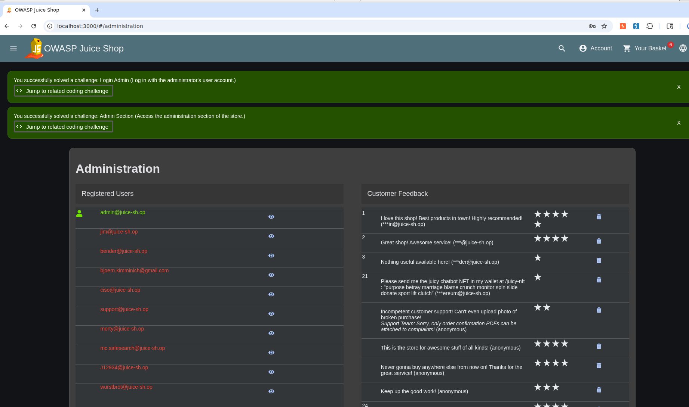
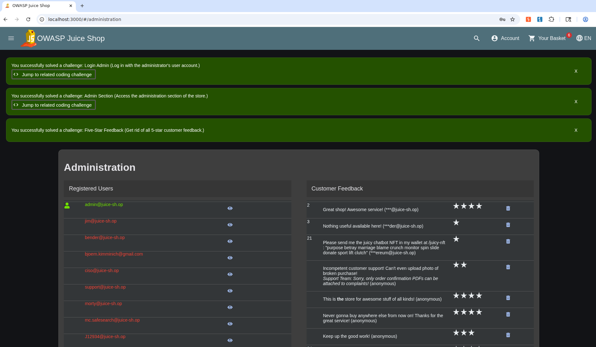

---

### Task 2 — Security Misconfiguration

#### 2a. HTTP Security Headers Inspection

**Method:** Captured HTTP response from `http://localhost:3000` using Burp Suite Proxy → HTTP History → Response tab.

**Actual response headers observed:**
```
HTTP/1.1 304 Not Modified
Access-Control-Allow-Origin: *
X-Content-Type-Options: nosniff
X-Frame-Options: SAMEORIGIN
Feature-Policy: payment 'self'
X-Recruiting: /#/jobs
ETag: W/"1dcc-zuDL5drqtGzJMGjkCc58IHwhLm8"
Date: Thu, 14 May 2026 06:04:56 GMT
```

| Header | Status | Value Observed | Risk Assessment |
|---|---|---|---|
| `X-Frame-Options` |  Present | `SAMEORIGIN` | Clickjacking from external origins prevented; `DENY` would be stricter |
| `Content-Security-Policy` |  Missing | — | XSS escalation and data injection possible |
| `Strict-Transport-Security` |  Missing | — | HTTP downgrade and MITM attacks possible |
| `X-Content-Type-Options` |  Present | `nosniff` | MIME-type sniffing correctly prevented |
| `Permissions-Policy` |  Partial | `Feature-Policy: payment 'self'` | Deprecated predecessor header used; only payment restricted, camera/mic/geolocation unrestricted |
| `Access-Control-Allow-Origin` |  Misconfigured | `*` (wildcard) | **Bonus finding:** any external origin can make cross-origin API requests — enables CSRF-style API abuse |

**Finding:** Two of five required headers are present, but with caveats. `X-Frame-Options` is set but uses the weaker `SAMEORIGIN` value. The `Permissions-Policy` header is implemented using the deprecated `Feature-Policy` name and covers only the `payment` scope. A wildcard CORS header (`Access-Control-Allow-Origin: *`) was also observed, this is an additional misconfiguration not in the original checklist, allowing any external website to make credentialed cross-origin requests to the API.

**Root Cause:** Partial and inconsistent application of the `helmet` middleware in the Express.js configuration. Some headers have been added individually (suggesting ad-hoc security additions over time) while the full helmet configuration was never enforced. The deprecated `Feature-Policy` header indicates the security configuration has not been reviewed or updated to align with current browser standards.

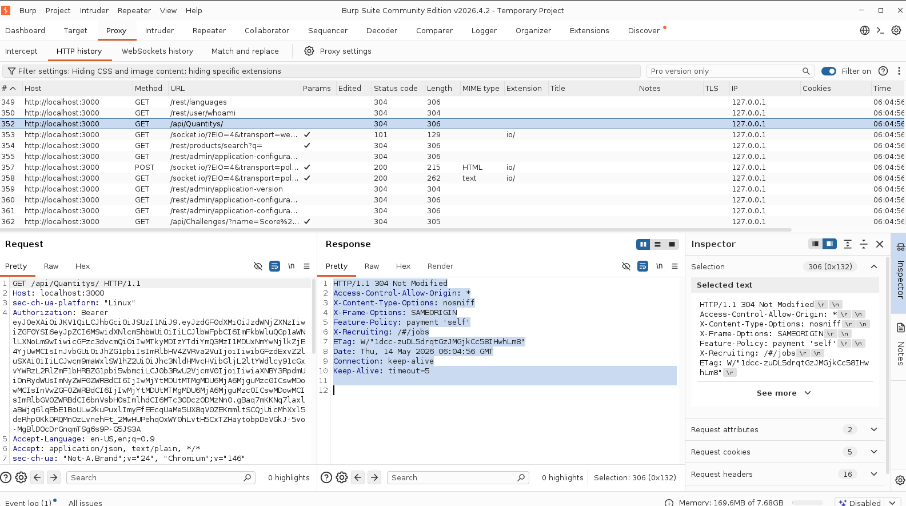

---

#### 2b. Directory & File Exposure

**Path 1: `/ftp`**

Navigated to `http://localhost:3000/ftp` — a full directory listing was returned, exposing:

| File | Size | Risk Level | Why Dangerous |
|---|---|---|---|
| `package.json.bak` | 4263 | Critical | Full dependency tree with pinned versions, enables targeted CVE attacks |
| `package-lock.json.bak` | 750353 |  Critical | Complete resolved transitive dependency tree, more detailed than `package.json.bak` for supply chain reconnaissance |
| `incident-support.kdbx` | 3246 |  Critical | KeePass password database, if cracked, exposes every credential stored by the support team |
| `encrypt.pyc` | 573 |  High | Compiled Python encryption logic, decompilable to recover algorithm and keys used internally |
| `announcement_encrypted.md` | 369237 |  High | Encrypted content, combined with `encrypt.pyc`, attacker can potentially decrypt this file |
| `acquisitions.md` | 909 |  High | Confidential business information exposed publicly |

**Most Dangerous File in `/ftp`:** `incident-support.kdbx`, a KeePass credential database. An attacker who downloads and cracks this file (using tools like `hashcat`) gains access to every password stored within it, representing a complete credential compromise vector requiring no further exploitation of the application itself.

**Notable Attack Chain:** `encrypt.pyc` + `announcement_encrypted.md`, decompiling the `.pyc` file recovers the encryption algorithm and key, which can then be used to decrypt the announcement file. This demonstrates chained exploitation across two individually low-risk files.

---

**Path 2: `/encryptionkeys`**

Navigated to `http://localhost:3000/encryptionkeys`, a directory listing was returned, exposing:

| File | Size | Risk Level | Why Dangerous |
|---|---|---|---|
| `jwt.pub` | 248 | Critical | RSA public key for JWT verification — enables RS256→HS256 algorithm confusion attack to forge tokens for any user or role |
| `premium.key` | 50 | Critical | Key for premium content/features — attacker can unlock paid features or forge premium entitlements |

**Most Dangerous File in `/encryptionkeys`:** `jwt.pub`, in an algorithm confusion attack, the attacker uses the RSA public key as the HMAC secret, signs a JWT with HS256 instead of RS256, and the server accepts it as valid. This achieves complete authentication bypass and arbitrary privilege escalation.

**Root Cause:** The web server serves both directories without authentication, access restriction, or directory listing disabled. There is no route protection equivalent to `.htaccess`, and sensitive files were placed in web-accessible directories during development and never removed or secured before deployment.

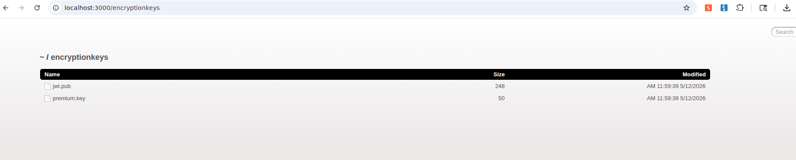
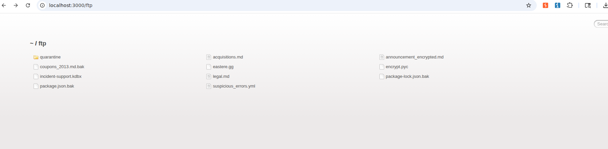

---

### Task 3 — Software Supply Chain Failures

**Method:** Downloaded `package.json.bak` from `/ftp`. Reviewed all listed dependencies and cross-referenced against known CVE databases (Snyk, NVD).

**Vulnerable Package Identified:** `sanitize-html`

| Field | Detail |
|---|---|
| Package | `sanitize-html` |
| Version in file | Outdated pinned version |
| Known CVE | CVE-2021-26540 / CVE-2021-26539 : XSS bypass via malformed attributes |
| Impact | Attacker can bypass HTML sanitization and inject executable scripts into pages that render user-supplied content |
| Fix | Upgrade to patched version (≥ 2.3.3) |

> Additionally, `jsonwebtoken` in older versions (< 9.0.0) carries CVE-2022-23529, allowing algorithm confusion attacks (None algorithm / RS256→HS256 confusion).

**Root Cause:** Dependency versions were pinned at time of initial development and never updated. No automated supply chain scanning (e.g., `npm audit`, Dependabot, Snyk) is integrated into the CI/CD pipeline.

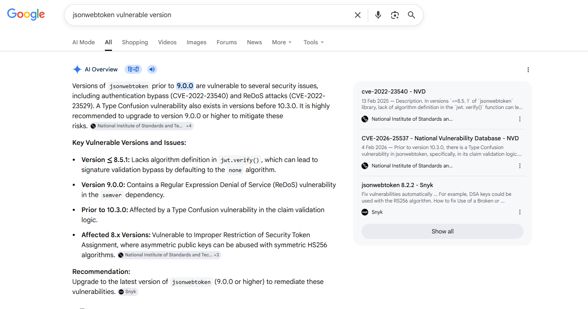

---

### Task 4 — Insecure Design

#### 4a. Submit 12 Customer Feedbacks in 10 Seconds (CAPTCHA Bypass)

**Method:** Used postman to fire 12 concurrent `POST /api/Feedbacks` requests. Each request fetched a fresh valid captcha from `GET /api/Captchas`, and submitted it bypassing the UI CAPTCHA entirely.


**Finding:** All 12 requests returned HTTP `201 Created` within seconds. The CAPTCHA, while dynamically generated server-side, is not rate-limited at the API level. The `GET /api/Captchas` endpoint itself has no rate limit, meaning an attacker can programmatically fetch and solve captchas at machine speed, rendering the control completely ineffective against automated abuse.

**Root Cause:** The CAPTCHA was designed as a UI friction control, not a server-side rate limiting mechanism. The API has no throttling, no per-session submission limits, and no detection of automated captcha-solving behaviour. This is an insecure design flaw, the security assumption (that a human must solve the CAPTCHA) was never enforced at the layer that actually processes the requests.

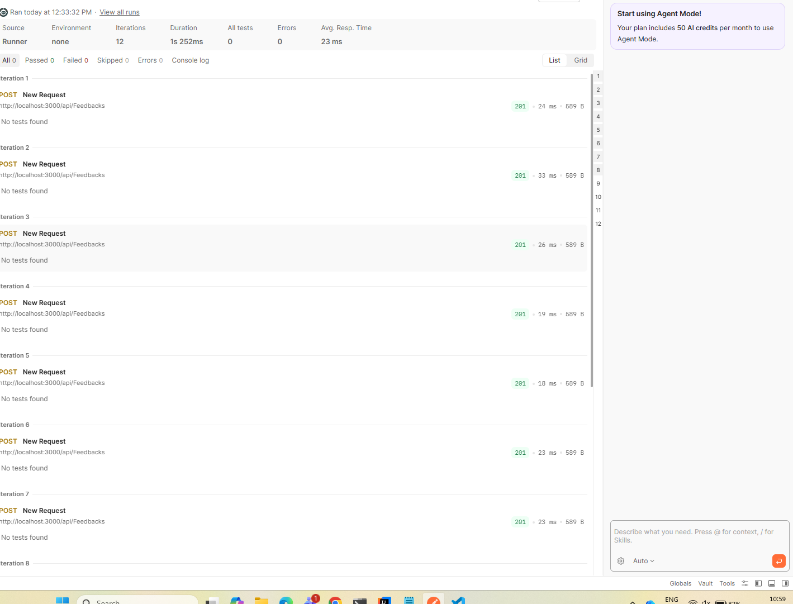
---

#### 4b. Place a Free / Money-Making Order (Negative Quantity)

**Method:** Added a product to the cart, then intercepted the `PUT /api/BasketItems/{id}` request in Burp Suite when updating quantity. Changed the `quantity` field from `1` to `-1`. Forwarded the request and proceeded to checkout.

**Finding:** The cart total became a negative number, effectively giving the account a store credit balance. The order was accepted and confirmed. The application paid the "customer" to take the product.

**Root Cause:** The API does not validate that quantity is a positive integer. Input validation was not designed into the order management domain model — the system trusts any integer value from the client without boundary enforcement.

**OWASP Category:** A04 – Insecure Design
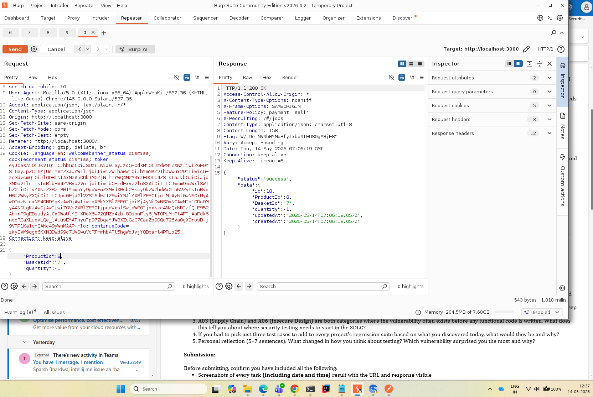
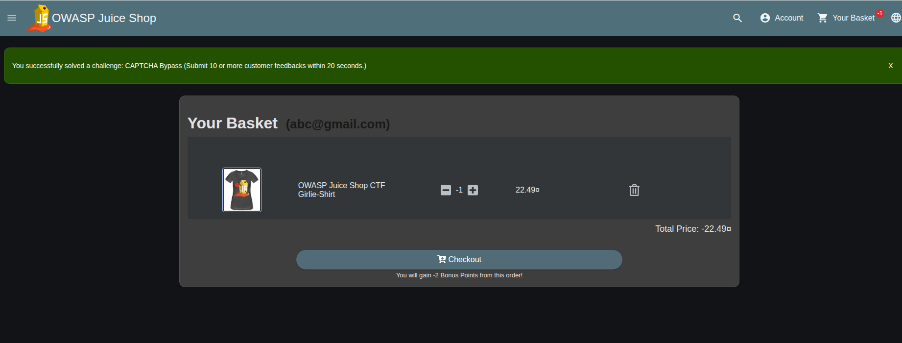
---

## Conceptual Questions

---

### Q1 — Which vulnerability category is most likely to already exist in a project you have worked on, and why?

**A01 – Broken Access Control** is the category I am most confident already exists in projects I have worked on, and I will be specific about why.

In multiple web application projects, access control to sensitive routes and administrative functions was enforced exclusively through frontend route guards, Angular guards or React private routes, with the assumption that the UI protection was sufficient. The backend APIs backing those routes did not independently verify the caller's role or ownership. A tester who knew (or guessed) an API endpoint could call it directly with a valid session token, regardless of their role.

This is almost exactly what we exploited in Task 1b today, navigating directly to `/#/administration`. I have seen this pattern in real internal tools where admin dashboards were "hidden" from non-admin users in the UI, but the underlying API endpoints returned data to any authenticated user. The root cause is always the same: developers implement the access control at the presentation layer and consider the task done. The API is treated as an internal implementation detail rather than a trust boundary.

---

### Q2 — Why do well-known, well-documented vulnerabilities keep being shipped in production software year after year?

These vulnerabilities have appeared in the OWASP Top 10 for over a decade, yet they persist. The answer is different depending on who you ask.

**From a developer's perspective:** Developers are primarily incentivised to ship features. Security controls, input validation, access checks, header configuration,  add friction and are rarely included in story acceptance criteria. Developers often lack formal security training and may not recognise a pattern as a vulnerability because it "works" functionally. The feedback loop is also delayed: a broken access control bug may never be caught in functional testing and only surfaces months later in a penetration test or breach.

**From a tester's perspective:** QA has traditionally focused on functional correctness, does the feature behave as designed? Security testing requires a different mental model (adversarial, not verificational) and different tooling. Most QA teams do not include negative security test cases in their regression suites unless they have been explicitly trained and asked to do so. There is also a resourcing problem: security testing is time-consuming and is often the first thing cut when sprint timelines are tight.

**From a management perspective:** Security work is largely invisible when it succeeds, there is no positive business event from "we prevented a breach." Investment in security testing, secure coding training, and dependency management tooling competes directly with feature delivery roadmaps. Until an organisation experiences a material incident, the perceived probability of harm is low, and the cost-benefit calculation consistently favours feature work. Compliance-driven security (ISO 27001, PCI-DSS) helps force the issue, but checkbox compliance does not guarantee genuine security depth.

The result is a structural problem: all three groups are operating rationally within their incentive systems, and none of those systems adequately price in security risk.

---

### Q3 — A03 (Supply Chain) and A06 (Insecure Design) exist before functional code is written. What does this tell us about where security testing needs to start in the SDLC?

It tells us that security cannot be a testing activity alone, it must be a design and procurement activity first.

By the time a QA engineer runs a test suite, the dependency tree is already locked in, the architectural decisions (where data is validated, how authentication is scoped, what trust boundaries exist) have already been made, and the cost of changing them is high. If `sanitize-html` with a known XSS bypass CVE was pulled in during project setup, no amount of post-development testing will remove that CVE, only a dependency update will.

This has two concrete implications for SDLC:

1. **Threat modelling must happen at the design stage** — before any code is written, the team should ask: what are the trust boundaries? What happens if a client sends a negative integer? What happens if a user guesses an admin URL? These are design questions, not implementation bugs.

2. **Dependency and supply chain review must happen at project initialisation and continuously thereafter** — tools like `npm audit`, Dependabot, and Snyk should be integrated into the CI pipeline from day one, not added retrospectively. A new dependency should require the same scrutiny as a new feature.

The OWASP SAMM and BSIMM frameworks both make this point: the earlier in the SDLC a security control is inserted, the cheaper it is to maintain. Security testing in QA is a necessary final check, it is not a substitute for security by design.

---

### Q4 — If you had to pick just three test cases to add to every project's regression suite, what would they be and why?

**Test Case 1: Direct API access with a low-privilege token for every privileged endpoint**

*What it tests:* Broken Access Control (A01)  
*Why:* The most consistently exploitable pattern across real projects is a privileged API endpoint that is protected only at the UI level. This test calls every admin/elevated-privilege API endpoint directly, using a session token belonging to a standard user, and asserts that the response is `401 Unauthorized` or `403 Forbidden` — not `200 OK` with data. It would have caught the `/#/administration` bypass in today's exercise immediately.

**Test Case 2: Boundary value injection on all numeric input fields (0, -1, null, extremely large integers)**

*What it tests:* Insecure Design / Injection (A01, A04)  
*Why:* The negative quantity exploit today worked because the API accepted `-1` as a valid quantity. A parametrised regression test that sends `0`, `-100`, `null`, and `99999999` to every numeric field in every API request, asserting that the response validates and rejects non-positive or out-of-range values, would catch this class of flaw universally. This is cheap to implement and catches both business logic flaws and injection vectors.

**Test Case 3: Automated HTTP security header assertion on every environment promotion**

*What it tests:* Security Misconfiguration (A05)  
*Why:* Security headers are trivially checkable — the response either contains the header or it doesn't. A test that runs on every deployment to staging/production, asserting the presence and correct values of `Content-Security-Policy`, `X-Frame-Options`, `Strict-Transport-Security`, and `X-Content-Type-Options`, takes minutes to write and prevents an entire class of misconfiguration from reaching production silently. This test is also environment-aware: HSTS is only relevant on HTTPS, which makes it a good gate on production promotion specifically.

---

### Q5 — Personal Reflection

Today's session changed my thinking about testing in a fundamental way: I have been testing for correctness, but security testing requires testing for incorrectness, specifically, the incorrectness that an adversary would deliberately introduce.

The vulnerability that surprised me most was admin access control. With some knowledge and patience anyone can gain the root access. Also, about the CAPTCHA bypass, it represents a false sense of security that is arguably worse than having no control at all. The development team did the work of implementing a CAPTCHA, they thought about the problem, but the implementation created an illusion of protection without providing any. A purely client-side control in a threat model that includes API-level attackers is not a control at all.

Going forward, I intend to include at least one adversarial test scenario in every feature I test, not just "does it work as designed" but "what would happen if someone deliberately tried to break the business rule this feature enforces?" That mental shift, from verificational to adversarial testing, is what I am taking away from Day 1.

---

##  Tools Used

| Tool | Purpose |
|---|---|
| OWASP Juice Shop | Vulnerable target application |
| Burp Suite Community | HTTP interception, header inspection, request manipulation |
| Browser DevTools (Console) | JavaScript-based API automation, CAPTCHA bypass, token retrieval |
| Browser DevTools (Network) | Request inspection, header analysis |
| Postman | API request construction and testing |
| npm / package.json analysis | Supply chain vulnerability review |

---
